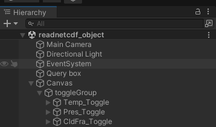

1. Create the canvas ()
2. Create a number of toggles by right-clicking in the hierarchy > UI > Toggle ()
3. Name each toggle e.g. 'Temp_Toggle', 'Pres_Toggle', 'CldFra_Toggle'. Use this notation in the main script to refer to each toggle - then when each toggle is called (i.e. pressed) the string message will be updated as well as the array_4d.
4. Create a new game object and add 'Toggle Group' as a component. Rename this object 'toggleGroup'. Move all toggles inside this parent toggle group. ()
5. Add the script to an object. Because we included '[SerializeField] private ToggleGroup toggleGroup;' to the script, if you click on the Inspector you should now see 'ToggleGroup' as an option to set. Select 'toggleGroup'. Remember to assign the custom vertex shader/material as in previous examples. (note our object is called 'readnetcdf' in this example)
