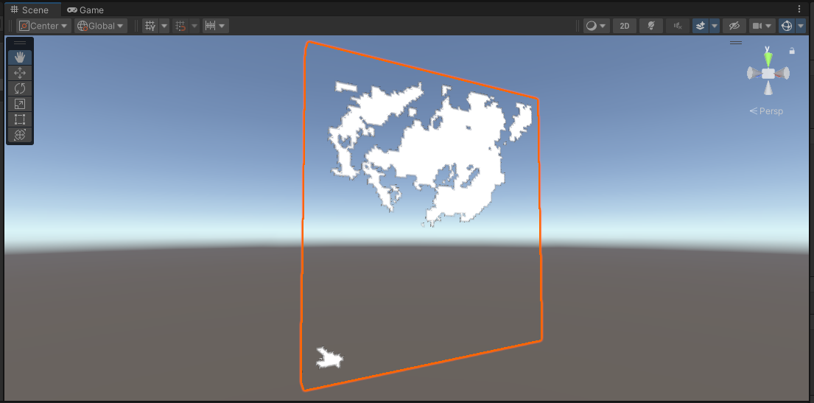

   

## Unity-NetCDF
This repository contains some basic C# and Shaderlab scripts for reading and displaying NetCDF data in Unity.

  

### Available scripts
- `CreateMesh.cs` - contains code for generating a variety of simple empty meshes in Unity (ranging from a single triangle to a 3D cube)
- `VertexColorShader.shader` - can be used to create a custom shader in Unity such that an RGBA colour is assigned to a vertex based on its position within a mesh
- `rainbow_cube.cs` - contains a function to construct a 3D mesh based on user-defined dimensions, and assign a semi-random RGBA colour to each vertex based on the custom shader 'VertexColorShader.shader'
- `Wind_Mesh.cs` - contains code to read in a remote NetCDF file and plot the horizontal wind field onto a 3D mesh (by assigning the data values to the mesh vertex) using the custom vertex shader 'VertexColorShader.shader'
- `netcdf_mesh_update.cs` - contains code to read in a local NetCDF file (user must provide their own), construct a 3D mesh and plot data onto it. This script contains functionality to move forward and backward in time using the keyboard arrow keys. This script was developed using cloud fraction data from a WRF file but can be modified for other types of data.
- `MultipleFields/wrf_multi_fields.cs` - contains code similar to `netcdf_mesh_updates.cs` but includes additional 'toggle' functionality to switch between different meteorological fields on-the-fly

### Installing libraries in Unity
Most of these scripts use third-party libraries to read NetCDF files using C#. These are:
- [UCAR's NetCDF-C](https://docs.unidata.ucar.edu/netcdf-c/current/winbin.html)
- [nuget's SDSLite](https://www.nuget.org/packages/SDSLite) (dependent on NetCDF-C)

Download these packages to your Assets/Plugins folder within your Unity project.

### How to use the scripts
- Create a new project using Unity Editor (select 3D Built-In Render Pipline or Universal 3D)
- In the Projects area, navigate to your Assets and save the script(s) into a folder called Scripts and the shader into a folder called Assets (if these folders don't exist already, create them)
- Double-click on the script in the Project panel to edit as required. You may need to set your default script editor (IDE) in Unity if you have not done this already.
- If making use of the custom vertex shader, create a new material under Assets/Materials (again, create the folder if it doesn't already exist) and assign the custom shader to the material 
- Create a new object in the Hierarchy panel (by right-clicking, and selecting 'Create Empty')
- Add components to the new object: a mesh filter, a mesh renderer, and a C# script (link the appropriate script)
- If making use of the custom vertex shader, change the mesh renderer from its default material to the custom material you made earlier
- During these steps, you will see Unity attempt to compile the code. Check the Project/Console section to see if there are any errors in compilation.
- If compilation is successful, hit the 'play' button in the Scene to execute the code.

### Example screenshots
Here is a screenshot to show what the output of `rainbow_cube.cs` should look like if successful:

Here is a screenshot to show what the output of `Wind_Mesh.cs` should look like if successful (blue = negative velocity, red = positive, white = neutral):

Here is a screenshot to show what the output of `netcdf_mesh_update.cs` might look like (it will depend on your file!), showing the cloud fraction (where 0 is transparent and 1 is solid white) from a WRF model output file at a particular time frame:

