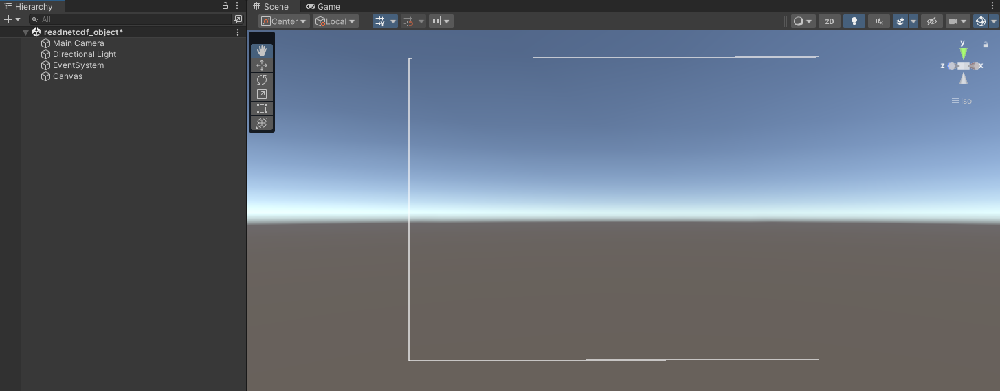
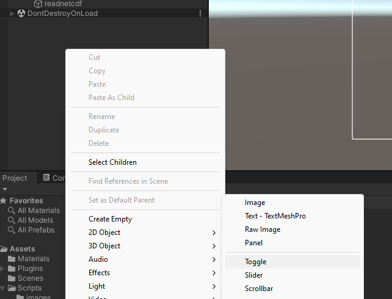
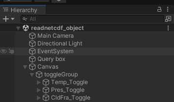
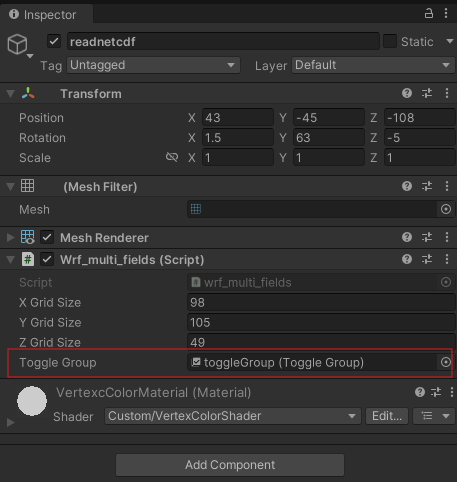

1. Create a canvas area by right-clicking in the Hierarchy panel and selecting UI > Canvas  

2. Create some toggles by right-clicking in the Hierarchy panel and selecting > UI > Toggle. Move these within the canvas area.  

3. Name each toggle e.g. 'Temp_Toggle', 'Pres_Toggle', 'CldFra_Toggle'. Use the same notation in the main script `wrf_multi_fields.cs` to refer to each toggle; then, when each toggle is called (i.e. pressed), the string message and the data rendered on the mesh will be updated.

4. Create a new game object in the Hierarchy panel and add 'Toggle Group' as a component. Rename this object 'toggleGroup'. Move all the toggles inside this parent toggle group.  

5. Create a new game object in the Hierarchy panel (in our example, this is called `readnetcdf`) and add a mesh filter and mesh renderer. As in previous examples, changes the mesh renderer from its default material to the custom RGB material. Then add the script `wrf_multi_fields.cs` to the object. Because we included `[SerializeField] private ToggleGroup toggleGroup;` in the script, when you click on the Inspector you should now see 'ToggleGroup' as an option to set. Select 'toggleGroup'. Remember to assign the custom vertex shader/material as in previous examples.  

