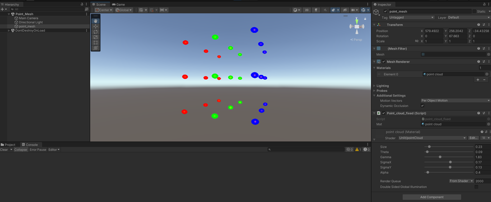

## Representing mesh vertices as a point cloud

1. Create a game object in the Unity Hierarchy panel called 'point_mesh'
2. Assign a mesh filter and a mesh renderer to the object in the Unity Inspector panel.
3. Save 'pointCloud.shader' as a shader in Unity and create a new material based on this called 'point cloud'. Assign this material to the mesh renderer in the Inspector panel.
4. Assign the script 'pointCloud.cs' to the object. In the Inspector panel, ensure that 'Mat' is also assigned to the 'point cloud' material.
5. Run the scene. You should be able to change the aesthetics of the point cloud using the slides in the Inspector panel:

   
